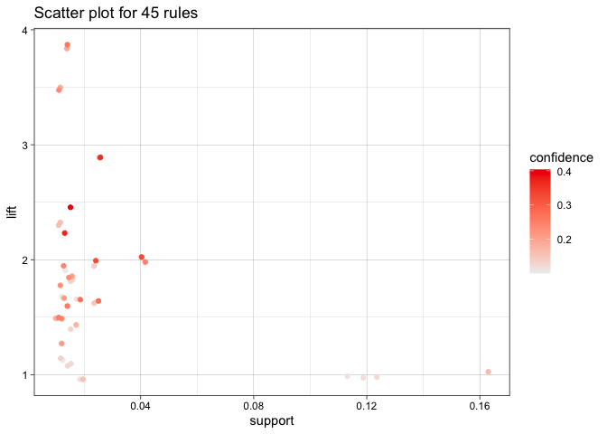

# Question 1

## Choose important components from PCA

    ## Importance of components:
    ##                           Comp.1    Comp.2    Comp.3     Comp.4     Comp.5
    ## Standard deviation     1.7405178 1.5790637 1.2474403 0.98509020 0.84838913
    ## Proportion of Variance 0.2754426 0.2267115 0.1414861 0.08823201 0.06544317
    ## Cumulative Proportion  0.2754426 0.5021541 0.6436401 0.73187216 0.79731533
    ##                            Comp.6     Comp.7     Comp.8     Comp.9    Comp.10
    ## Standard deviation     0.77924209 0.72324148 0.70811941 0.58049304 0.47713805
    ## Proportion of Variance 0.05521016 0.04755989 0.04559184 0.03063855 0.02069961
    ## Cumulative Proportion  0.85252548 0.90008537 0.94567722 0.97631577 0.99701538
    ##                            Comp.11
    ## Standard deviation     0.181178776
    ## Proportion of Variance 0.002984618
    ## Cumulative Proportion  1.000000000

From this graph and table, we find that the percentage components 1-6 is
85.25% of whole components. So we think components 1-6 are imporntant
variables in this question.

## Red or White Wine

### kmeans

We used Kmeans and PCA to find if we can distinuish red wine from white
wine. Firstly, the first picture illustrates the mean values of chemical
properties of red and white wine and the second picture is the mean
values of chemical properties in two clusters after using kmeans.After
comparing two pictures, we found that red wine occupies in cluster 2 and
the proportion of white wine is very large in cluster 1. So kmeans helps
us distinguish red wine from white wine.

### PCA

Then we used the PCA method of using six important variables in this
process. From this picutre, we found that the mean value of first
important component in red wine is different from the mean value of
first important component in white wine. This can help us distinguish
red wine from white wine.

## Wine’s quality

### kmeans

We also used Kmeans and PCA to find if we can identify high or low
quality of wine. Firstly, from these two pictures, We compared mean
values of chemical properties of seven different qualities of wine and
seven clusters’ chemical properties’ mean value after we using kmeans
method. From seven clusters’ plot, it’s very difficult to identify high
quality or low quality from chemical properties. One quality level might
has high value in some properties and low value in some properties. So
using kmeans method might be not effective to distinguish high quality
wine from low quality wine.

### PCA

Then we chose six important variables to run PCA method. However, from
this plot, the component 1 and component 2 are different and one quality
number may has high mean value of the component 1 and the low value of
component 2. So it’s difficult to distinguish high quality wine from low
quality wine about running PCA method.

# Question 2

Now that the dataset has been loaded, it must be prepared for
dimensionality reduction.

    ##                        PC1       PC2
    ## chatter        -0.19758993 0.2480803
    ## current_events -0.06089178 0.1406842
    ## travel         -0.01323453 0.1822554
    ## photo_sharing  -0.23524073 0.1326765
    ## uncategorized  -0.07723377 0.0429770
    ## tv_film        -0.03340567 0.1226475

Normalize key words counts to their frequencies The aim of this step is
to standardize the range of the continuous initial variables so that
each one of them contributes equally to the analysis.

    ## [1] "religion"      "sports_fandom" "parenting"     "food"         
    ## [5] "school"

    ## [1] "fashion"       "cooking"       "shopping"      "chatter"      
    ## [5] "photo_sharing"

We can see that the first principal component (PC1) has high values for
“religion”, “sports\_fandom”, “parenting”, “food” and “school” which
indicates that this principle component places most of its emphasis on
politics.

    ## [1] "chatter"    "politics"   "travel"     "shopping"   "automotive"

    ## [1] "fashion"          "cooking"          "outdoors"         "personal_fitness"
    ## [5] "health_nutrition"

We can see that the first principal component (PC2) has high values for
“chatter”, “politics”, “travel”, “shopping” and “automotive” which
indicates that this principal component describes the most variation in
these variables.

Calculate and plot Proportion of Variance Explained.We can see from the
scree plot above that the point at which the proportion of variance
explained by each subsequent principal component drops off is from the
10th principal component.

After we using PCA method and the data of principal component 1, this
group can be students because they are so interested in “religion”,
“sports”, “parents”, and “school”. We can focus on this group and create
products for this market segmentation like sports products and healthy
food. From the data of principal component 2, the group might be adult
and middle-aged who like discussing “travel”, “shopping”, “chatter”, and
“automotive”. We can focus on this group including shopping brands which
adults are crazy, travel places soveniors which people like in this
process. So this is our market segmentation ways of PCA method.

# Question 3

    ## 'data.frame':    15296 obs. of  4 variables:
    ##  $ V1: chr  "citrus fruit" "tropical fruit" "whole milk" "pip fruit" ...
    ##  $ V2: chr  "semi-finished bread" "yogurt" NA "yogurt" ...
    ##  $ V3: chr  "margarine" "coffee" NA "cream cheese " ...
    ##  $ V4: chr  "ready soups" NA NA "meat spreads" ...

    ##       V1                 V2                 V3                 V4           
    ##  Length:15296       Length:15296       Length:15296       Length:15296      
    ##  Class :character   Class :character   Class :character   Class :character  
    ##  Mode  :character   Mode  :character   Mode  :character   Mode  :character

    ## 
    ##  FALSE 
    ## 130101

    ## [1] "citrus fruit"        "semi-finished bread" "margarine"          
    ## [4] "ready soups"

    ## [1] "tropical fruit" "yogurt"         "coffee"

    ## Apriori
    ## 
    ## Parameter specification:
    ##  confidence minval smax arem  aval originalSupport maxtime support minlen
    ##         0.1    0.1    1 none FALSE            TRUE       5    0.01      1
    ##  maxlen target  ext
    ##       2  rules TRUE
    ## 
    ## Algorithmic control:
    ##  filter tree heap memopt load sort verbose
    ##     0.1 TRUE TRUE  FALSE TRUE    2    TRUE
    ## 
    ## Absolute minimum support count: 152 
    ## 
    ## set item appearances ...[0 item(s)] done [0.00s].
    ## set transactions ...[169 item(s), 15296 transaction(s)] done [0.00s].
    ## sorting and recoding items ... [71 item(s)] done [0.00s].
    ## creating transaction tree ... done [0.00s].
    ## checking subsets of size 1 2 done [0.00s].
    ## writing ... [45 rule(s)] done [0.00s].
    ## creating S4 object  ... done [0.00s].

    ##      lhs                     rhs                support    confidence
    ## [1]  {}                   => {soda}             0.11212082 0.1121208 
    ## [2]  {}                   => {rolls/buns}       0.11826621 0.1182662 
    ## [3]  {}                   => {other vegetables} 0.12441161 0.1244116 
    ## [4]  {}                   => {whole milk}       0.16429132 0.1642913 
    ## [5]  {curd}               => {whole milk}       0.01261768 0.3683206 
    ## [6]  {butter}             => {whole milk}       0.01438285 0.4036697 
    ## [7]  {whipped/sour cream} => {whole milk}       0.01144090 0.2482270 
    ## [8]  {pip fruit}          => {tropical fruit}   0.01268305 0.2607527 
    ## [9]  {tropical fruit}     => {pip fruit}        0.01268305 0.1879845 
    ## [10] {pip fruit}          => {other vegetables} 0.01091789 0.2244624 
    ## [11] {pip fruit}          => {whole milk}       0.01255230 0.2580645 
    ## [12] {pastry}             => {rolls/buns}       0.01019874 0.1782857 
    ## [13] {citrus fruit}       => {tropical fruit}   0.01248692 0.2346437 
    ## [14] {tropical fruit}     => {citrus fruit}     0.01248692 0.1850775 
    ## [15] {citrus fruit}       => {other vegetables} 0.01281381 0.2407862 
    ## [16] {other vegetables}   => {citrus fruit}     0.01281381 0.1029953 
    ## [17] {citrus fruit}       => {whole milk}       0.01281381 0.2407862 
    ## [18] {sausage}            => {rolls/buns}       0.01078713 0.1785714 
    ## [19] {sausage}            => {other vegetables} 0.01261768 0.2088745 
    ## [20] {other vegetables}   => {sausage}          0.01261768 0.1014188 
    ## [21] {sausage}            => {whole milk}       0.01255230 0.2077922 
    ## [22] {bottled water}      => {soda}             0.01464435 0.2060718 
    ## [23] {soda}               => {bottled water}    0.01464435 0.1306122 
    ## [24] {tropical fruit}     => {root vegetables}  0.01098326 0.1627907 
    ## [25] {root vegetables}    => {tropical fruit}   0.01098326 0.1567164 
    ## [26] {tropical fruit}     => {other vegetables} 0.01549425 0.2296512 
    ## [27] {other vegetables}   => {tropical fruit}   0.01549425 0.1245402 
    ## [28] {tropical fruit}     => {whole milk}       0.01830544 0.2713178 
    ## [29] {whole milk}         => {tropical fruit}   0.01830544 0.1114206 
    ## [30] {root vegetables}    => {other vegetables} 0.02536611 0.3619403 
    ## [31] {other vegetables}   => {root vegetables}  0.02536611 0.2038886 
    ## [32] {root vegetables}    => {whole milk}       0.02262029 0.3227612 
    ## [33] {whole milk}         => {root vegetables}  0.02262029 0.1376840 
    ## [34] {yogurt}             => {rolls/buns}       0.01189854 0.1326531 
    ## [35] {rolls/buns}         => {yogurt}           0.01189854 0.1006081 
    ## [36] {yogurt}             => {other vegetables} 0.01588651 0.1771137 
    ## [37] {other vegetables}   => {yogurt}           0.01588651 0.1276931 
    ## [38] {yogurt}             => {whole milk}       0.02425471 0.2704082 
    ## [39] {whole milk}         => {yogurt}           0.02425471 0.1476323 
    ## [40] {soda}               => {rolls/buns}       0.01425209 0.1271137 
    ## [41] {rolls/buns}         => {soda}             0.01425209 0.1205086 
    ## [42] {rolls/buns}         => {whole milk}       0.01830544 0.1547816 
    ## [43] {whole milk}         => {rolls/buns}       0.01830544 0.1114206 
    ## [44] {other vegetables}   => {whole milk}       0.04086036 0.3284288 
    ## [45] {whole milk}         => {other vegetables} 0.04086036 0.2487067 
    ##      coverage   lift     count
    ## [1]  1.00000000 1.000000 1715 
    ## [2]  1.00000000 1.000000 1809 
    ## [3]  1.00000000 1.000000 1903 
    ## [4]  1.00000000 1.000000 2513 
    ## [5]  0.03425732 2.241875  193 
    ## [6]  0.03563023 2.457036  220 
    ## [7]  0.04609048 1.510895  175 
    ## [8]  0.04864017 3.864800  194 
    ## [9]  0.06746862 3.864800  194 
    ## [10] 0.04864017 1.804191  167 
    ## [11] 0.04864017 1.570774  192 
    ## [12] 0.05720450 1.507495  156 
    ## [13] 0.05321653 3.477820  191 
    ## [14] 0.06746862 3.477820  191 
    ## [15] 0.05321653 1.935400  196 
    ## [16] 0.12441161 1.935400  196 
    ## [17] 0.05321653 1.465605  196 
    ## [18] 0.06040795 1.509911  165 
    ## [19] 0.06040795 1.678898  193 
    ## [20] 0.12441161 1.678898  193 
    ## [21] 0.06040795 1.264779  192 
    ## [22] 0.07106433 1.837944  224 
    ## [23] 0.11212082 1.837944  224 
    ## [24] 0.06746862 2.322805  168 
    ## [25] 0.07008368 2.322805  168 
    ## [26] 0.06746862 1.845898  237 
    ## [27] 0.12441161 1.845898  237 
    ## [28] 0.06746862 1.651444  280 
    ## [29] 0.16429132 1.651444  280 
    ## [30] 0.07008368 2.909216  388 
    ## [31] 0.12441161 2.909216  388 
    ## [32] 0.07008368 1.964566  346 
    ## [33] 0.16429132 1.964566  346 
    ## [34] 0.08969665 1.121648  182 
    ## [35] 0.11826621 1.121648  182 
    ## [36] 0.08969665 1.423611  243 
    ## [37] 0.12441161 1.423611  243 
    ## [38] 0.08969665 1.645907  371 
    ## [39] 0.16429132 1.645907  371 
    ## [40] 0.11212082 1.074810  218 
    ## [41] 0.11826621 1.074810  218 
    ## [42] 0.11826621 0.942117  280 
    ## [43] 0.16429132 0.942117  280 
    ## [44] 0.12441161 1.999064  625 
    ## [45] 0.16429132 1.999064  625

    ##     lhs                 rhs              support    confidence coverage  
    ## [1] {pip fruit}      => {tropical fruit} 0.01268305 0.2607527  0.04864017
    ## [2] {tropical fruit} => {pip fruit}      0.01268305 0.1879845  0.06746862
    ## [3] {citrus fruit}   => {tropical fruit} 0.01248692 0.2346437  0.05321653
    ## [4] {tropical fruit} => {citrus fruit}   0.01248692 0.1850775  0.06746862
    ##     lift    count
    ## [1] 3.86480 194  
    ## [2] 3.86480 194  
    ## [3] 3.47782 191  
    ## [4] 3.47782 191

    ##     lhs                 rhs              support    confidence coverage  
    ## [1] {pip fruit}      => {tropical fruit} 0.01268305 0.2607527  0.04864017
    ## [2] {tropical fruit} => {pip fruit}      0.01268305 0.1879845  0.06746862
    ## [3] {citrus fruit}   => {tropical fruit} 0.01248692 0.2346437  0.05321653
    ## [4] {tropical fruit} => {citrus fruit}   0.01248692 0.1850775  0.06746862
    ##     lift    count
    ## [1] 3.86480 194  
    ## [2] 3.86480 194  
    ## [3] 3.47782 191  
    ## [4] 3.47782 191

    ##     lhs    rhs                support   confidence coverage lift count
    ## [1] {}  => {soda}             0.1121208 0.1121208  1        1    1715 
    ## [2] {}  => {rolls/buns}       0.1182662 0.1182662  1        1    1809 
    ## [3] {}  => {other vegetables} 0.1244116 0.1244116  1        1    1903 
    ## [4] {}  => {whole milk}       0.1642913 0.1642913  1        1    2513

    ##     lhs                   rhs                support    confidence coverage  
    ## [1] {curd}             => {whole milk}       0.01261768 0.3683206  0.03425732
    ## [2] {butter}           => {whole milk}       0.01438285 0.4036697  0.03563023
    ## [3] {root vegetables}  => {other vegetables} 0.02536611 0.3619403  0.07008368
    ## [4] {root vegetables}  => {whole milk}       0.02262029 0.3227612  0.07008368
    ## [5] {other vegetables} => {whole milk}       0.04086036 0.3284288  0.12441161
    ##     lift     count
    ## [1] 2.241875 193  
    ## [2] 2.457036 220  
    ## [3] 2.909216 388  
    ## [4] 1.964566 346  
    ## [5] 1.999064 625

By choosing so many rules for simplicity, this can make sense to some
extent. As we can see, whipped/sour cream, curd, butter point to whole
milk, since they all belong to the milk/dairy products. In addition, we
can see that pastry point to rolls/buns. This is obviously logical. This
also looks meaningful to us!
